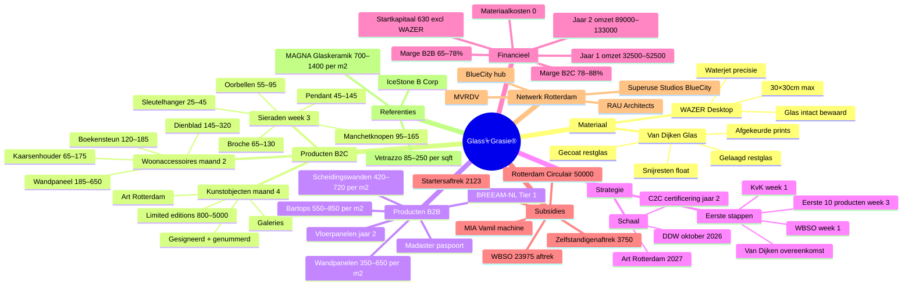

# Glass⏧Grasie® — Mindmap

## Verbindingskaart (Obsidian Graph)

De kernverbindingen in deze vault:

- [[Glass⏧Grasie® Hub]] ↔ alle 33 notes
- [[Van-Dijken-Glas]] ↔ [[Restmateriaal-Overeenkomst]], [[WAZER-Desktop]], [[Certificaat-van-Herkomst]]
- [[Product-B2B-Architectuur]] ↔ [[BREEAM-NL]], [[Madaster]], [[Superuse-Studios]]
- [[Product-Kunstobjecten]] ↔ [[Art-Rotterdam]], [[Mondriaan-Fonds]], [[Galerie-Strategie]]
- [[Financieel-Plan]] ↔ [[WBSO]], [[MIA-Vamil]], [[Subsidies-Overzicht]]
- [[Weekplan-16-Weken]] ↔ alle operationele notes

## Tags index

| Tag | Notes |
|-----|-------|
| `#strategie` | Executive-Summary, Businessplan-Overzicht, Missie-en-Positionering, Concurrentieanalyse, Marktanalyse |
| `#product` | Product-Sieraden, Product-Woonaccessoires, Product-Kunstobjecten, Product-B2B-Architectuur, Certificaat-van-Herkomst |
| `#financieel` | Financieel-Plan, Omzetprognose, Subsidies-Overzicht, WBSO, MIA-Vamil, Mondriaan-Fonds |
| `#operationeel` | Weekplan-16-Weken, WAZER-Desktop, Van-Dijken-Glas, Restmateriaal-Overeenkomst, KvK-Registratie |
| `#b2b` | B2B-Kanalen, Product-B2B-Architectuur, BREEAM-NL, Madaster, Superuse-Studios |
| `#kunst` | Product-Kunstobjecten, Art-Rotterdam, Dutch-Design-Week, Galerie-Strategie, Mondriaan-Fonds |
| `#netwerk` | Superuse-Studios, MVRDV, BlueCity-Rotterdam, RAU-Architects, MAGNA-Glaskeramik |
| `#subsidie` | WBSO, MIA-Vamil, Mondriaan-Fonds, Subsidies-Overzicht |
| `#referentie` | MAGNA-Glaskeramik, Vetrazzo |
